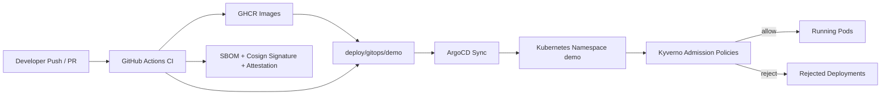

# Go Microservices with gRPC and Docker

This repository contains a small production-style microservices system built with Go:

- `gateway-service`: HTTP API that aggregates gRPC responses.
- `catalog-service`: product catalog with in-memory storage.
- `inventory-service`: stock service with in-memory storage.

## Repo overview

| Name | Path | Port(s) | Entrypoint | Dockerfile | Image Name | Dependencies |
| --- | --- | --- | --- | --- | --- | --- |
| `gateway-service` | `internal/gateway` | `8080` HTTP | `cmd/gateway-service/main.go` | `deployments/docker/gateway-service.Dockerfile` | `ghcr.io/vladfcs/golang-microservice-university-gateway-service` | `catalog-service:50051`, `inventory-service:50052` |
| `catalog-service` | `internal/catalog` | `50051` gRPC, `8081` health | `cmd/catalog-service/main.go` | `deployments/docker/catalog-service.Dockerfile` | `ghcr.io/vladfcs/golang-microservice-university-catalog-service` | none |
| `inventory-service` | `internal/inventory` | `50052` gRPC, `8082` health | `cmd/inventory-service/main.go` | `deployments/docker/inventory-service.Dockerfile` | `ghcr.io/vladfcs/golang-microservice-university-inventory-service` | none |

Container baseline for every service:

- multi-stage Docker build
- distroless final image
- non-root runtime with `USER 10001:10001`
- `/healthz` endpoint ready for Kubernetes probes

## Architecture

```text
HTTP Client
    |
    v
gateway-service (HTTP :8080)
    |------------------------------|
    v                              v
catalog-service (gRPC :50051)   inventory-service (gRPC :50052)
```

Each service follows a simple clean architecture flow:

```text
handler -> service -> repository
```

## End-to-End Flow



## Project layout

```text
.
├── api/proto/               # Proto definitions
├── cmd/                     # Service entrypoints
├── gen/                     # Generated protobuf Go code
├── internal/
│   ├── catalog/             # catalog-service layers
│   ├── gateway/             # gateway-service layers
│   ├── inventory/           # inventory-service layers
│   └── platform/            # shared logging and middleware
└── deployments/docker/      # Multi-stage Dockerfiles
```

## gRPC contracts

- Catalog
  - `GetProduct`
  - `CreateProduct`
- Inventory
  - `GetStock`
  - `ReserveStock`

Proto files live in:

- `api/proto/catalog/v1/catalog.proto`
- `api/proto/inventory/v1/inventory.proto`

## Generate protobuf code

```bash
make proto
```

## Run locally

In separate terminals:

```bash
make run-catalog
make run-inventory
make run-gateway
```

Health endpoints:

- `gateway-service`: `http://localhost:8080/healthz`
- `catalog-service`: `http://localhost:8081/healthz`
- `inventory-service`: `http://localhost:8082/healthz`

Fetch aggregated data:

```bash
curl http://localhost:8080/products/p-100
```

Example response:

```json
{
  "id": "p-100",
  "name": "Mechanical Keyboard",
  "description": "Hot-swappable mechanical keyboard",
  "price_cents": 12999,
  "currency": "USD",
  "inventory": {
    "product_id": "p-100",
    "available": 42,
    "reserved": 3
  }
}
```

## gRPC server and client usage

Server registration happens in:

- `cmd/catalog-service/main.go`
- `cmd/inventory-service/main.go`

Client usage happens in the gateway:

- `cmd/gateway-service/main.go`
- `internal/gateway/client/catalog/client.go`
- `internal/gateway/client/inventory/client.go`

You can also call the gRPC servers directly with `grpcurl`:

```bash
grpcurl -plaintext localhost:50051 catalog.v1.CatalogService/GetProduct \
  -d '{"id":"p-100"}'

grpcurl -plaintext localhost:50052 inventory.v1.InventoryService/GetStock \
  -d '{"product_id":"p-100"}'
```

Create a new product:

```bash
grpcurl -plaintext localhost:50051 catalog.v1.CatalogService/CreateProduct \
  -d '{"product":{"id":"p-300","name":"USB-C Dock","description":"11-in-1 dock","price_cents":8999,"currency":"USD"}}'
```

Reserve stock:

```bash
grpcurl -plaintext localhost:50052 inventory.v1.InventoryService/ReserveStock \
  -d '{"product_id":"p-100","quantity":2}'
```

## Build and test

```bash
make tidy
make build
make test
```

## Docker

Build images:

```bash
make docker-build IMAGE_TAG=dev
```

Dockerfiles:

- `deployments/docker/gateway-service.Dockerfile`
- `deployments/docker/catalog-service.Dockerfile`
- `deployments/docker/inventory-service.Dockerfile`

Why this container setup is a good baseline for Kubernetes:

- Multi-stage builds keep the runtime image small and avoid shipping the Go toolchain.
- Distroless runtime images reduce attack surface because they do not include a shell or package manager.
- Containers run as `USER 10001:10001`, which fits common `runAsNonRoot` Kubernetes policies.
- Each service exposes `/healthz`, which can be reused later for readiness and liveness probes.

Published image strategy:

- Registry: GHCR (`ghcr.io`)
- Mutable convenience tags like `latest` are intentionally not used.
- Main branch pushes publish `sha-<commit>` tags.
- Git tags like `v1.0.0` publish matching semver image tags.
- Every pushed image is signed keylessly with `cosign` via GitHub OIDC.
- A CycloneDX SBOM is generated and attached to the pushed image as a `cosign` attestation.

GitHub Actions workflow:

- `.github/workflows/publish-images.yml`

Example image names:

- `ghcr.io/<owner>/<repo>-gateway-service:sha-abc1234`
- `ghcr.io/<owner>/<repo>-catalog-service:v1.0.0`
- `ghcr.io/<owner>/<repo>-inventory-service:sha-abc1234`

Verify a signed image from the `main` branch:

```bash
cosign verify ghcr.io/vladfcs/golang-microservice-university-gateway-service:sha-<git-sha> \
  --certificate-oidc-issuer https://token.actions.githubusercontent.com \
  --certificate-identity-regexp 'https://github.com/VladFCS/golang-microservice-university/.github/workflows/publish-images.yml@refs/heads/main'
```

Successful verification should end with exit code `0` and output showing that the signature and GitHub Actions certificate identity were verified for `publish-images.yml`.

Verify the SBOM attestation:

```bash
cosign verify-attestation ghcr.io/vladfcs/golang-microservice-university-gateway-service:sha-<git-sha> \
  --type cyclonedx \
  --certificate-oidc-issuer https://token.actions.githubusercontent.com \
  --certificate-identity-regexp 'https://github.com/VladFCS/golang-microservice-university/.github/workflows/publish-images.yml@refs/heads/main'
```

Inspect the attached SBOM predicate after verification:

```bash
cosign verify-attestation ghcr.io/vladfcs/golang-microservice-university-gateway-service:sha-<git-sha> \
  --type cyclonedx \
  --certificate-oidc-issuer https://token.actions.githubusercontent.com \
  --certificate-identity-regexp 'https://github.com/VladFCS/golang-microservice-university/.github/workflows/publish-images.yml@refs/heads/main' \
| jq -r '.[0].payload' | base64 --decode | jq
```

## Kubernetes

Minimal manifests for a local cluster live in:

- `deploy/k8s/namespace.yaml`
- `deploy/k8s/gateway-deployment.yaml`
- `deploy/k8s/gateway-service.yaml`
- `deploy/k8s/catalog-deployment.yaml`
- `deploy/k8s/catalog-service.yaml`
- `deploy/k8s/inventory-deployment.yaml`
- `deploy/k8s/inventory-service.yaml`
- `deploy/k8s/kustomization.yaml`

Apply them with:

```bash
kubectl apply -k deploy/k8s
```

Kubernetes baseline included in every Deployment:

- consistent `app.kubernetes.io/*` labels and selectors
- readiness and liveness probes
- CPU and memory requests/limits
- `runAsNonRoot: true`
- `allowPrivilegeEscalation: false`
- `readOnlyRootFilesystem: true`

## GitOps and ArgoCD

GitOps source-of-truth for the demo environment lives in:

- `deploy/gitops/demo/kustomization.yaml`
- `deploy/gitops/demo/gateway-deployment.yaml`
- `deploy/gitops/demo/catalog-deployment.yaml`
- `deploy/gitops/demo/inventory-deployment.yaml`
- `deploy/argocd/demo-application.yaml`

The GitOps manifests target namespace `demo` and use GHCR image references. The publish workflow rewrites those image references to immutable digest form after a successful build, SBOM generation, signing, and attestation.

Install ArgoCD locally:

```bash
make argocd-install
```

Apply the ArgoCD `Application` resource:

```bash
make argocd-app-apply
```

Useful local checks:

```bash
make argocd-status
make argocd-admin-password
make argocd-ui
```

The `make argocd-ui` target forwards the ArgoCD UI to `https://localhost:8088`.

Expected local flow on minikube or kind:

1. `make minikube-up`
2. `make deploy`
3. `make argocd-install`
4. `kubectl apply --server-side -f https://github.com/kyverno/kyverno/releases/download/v1.15.2/install.yaml`
5. `kubectl create namespace demo --dry-run=client -o yaml | kubectl apply -f -`
6. `make kyverno-policies-apply`
7. `make argocd-app-apply`
8. `kubectl get applications -n argocd`

Once the `microservices-demo` application becomes `Synced` and `Healthy`, ArgoCD is managing the manifests from `deploy/gitops/demo`.

How CI updates GitOps automatically:

1. `.github/workflows/publish-images.yml` builds and pushes service images to GHCR.
2. The workflow signs the pushed digests with `cosign` and attaches SBOM attestations.
3. The same workflow writes the exact published image digests back into `deploy/gitops/demo/*-deployment.yaml`.
4. The workflow commits the updated GitOps manifests to `main`.
5. ArgoCD detects the Git change and syncs namespace `demo`.

That means `deploy/gitops/demo` is the desired deployment state, while `deploy/k8s` remains the simpler local-manual deployment path.

## Kyverno

Kyverno install and policy bundle:

- Install Kyverno with `make kyverno-install`
- Apply the admission policies with `make kyverno-policies-apply`
- Policies live in `deploy/kyverno/policies`
- Demo manifests live in `deploy/kyverno/demo`

Installed policy set:

- deny `:latest` tags
- require `runAsNonRoot`
- deny `privileged: true`
- deny `hostNetwork: true`
- deny `hostPath` volumes
- require CPU/memory requests and limits
- deny unsigned images and allow images signed by `.github/workflows/publish-images.yml`

Demo commands:

```bash
make kyverno-install
kubectl apply -f deploy/k8s/namespace.yaml
make kyverno-policies-apply
make kyverno-demo-bad-latest
make kyverno-demo-bad-run-as-nonroot
make kyverno-demo-bad-privileged
make kyverno-demo-bad-hostnetwork
make kyverno-demo-bad-hostpath
make kyverno-demo-bad-no-resources
make kyverno-demo-unsigned
make kyverno-demo-signed
```

Unsigned image reject scenario:

```bash
kubectl apply -f deploy/kyverno/demo/unsigned-image-deployment.yaml
```

Expected rejection example:

```text
Error from server: admission webhook "mutate.kyverno.svc" denied the request:
resource Deployment/app/unsigned-image-demo was blocked due to the following policies

verify-signed-images:
  verify-signed-images: image verification failed for nginx:1.27.4: signature not found
```

Signed image allow scenario:

```bash
kubectl apply -f deploy/kyverno/demo/signed-image-deployment.yaml
```

Expected success example:

```text
deployment.apps/signed-image-demo created
```

Kyverno log commands for the two scenarios:

```bash
kubectl logs -n kyverno deploy/kyverno-admission-controller | rg 'verify-signed-images|signature not found'
kubectl logs -n kyverno deploy/kyverno-admission-controller | rg 'signed-image-demo|verified image'
```

Example log snippets:

```text
policy=verify-signed-images rule=verify-signed-images resource=app/unsigned-image-demo result=fail message="image verification failed: signature not found"
policy=verify-signed-images rule=verify-signed-images resource=app/signed-image-demo result=pass message="verified image signature"
```

For the signed-image demo, replace `ghcr.io/vladfcs/golang-microservice-university-gateway-service:v1.0.0` with any image tag that has already been published and signed by the `Publish Docker Images` workflow if your registry does not yet contain `v1.0.0`.

## Demo

Diploma demo manifests live in `demo/`:

- `demo/unsigned.yaml`
- `demo/latest.yaml`
- `demo/privileged.yaml`
- `demo/hostnetwork.yaml`
- `demo/no-limits.yaml`
- `demo/good.yaml`

Demo apply commands:

```bash
kubectl apply -f demo/unsigned.yaml
kubectl apply -f demo/latest.yaml
kubectl apply -f demo/privileged.yaml
kubectl apply -f demo/hostnetwork.yaml
kubectl apply -f demo/no-limits.yaml
kubectl apply -f demo/good.yaml
```

Equivalent Make targets:

```bash
make demo-unsigned
make demo-latest
make demo-privileged
make demo-hostnetwork
make demo-no-limits
make demo-good
```

The `good.yaml` manifest is expected to be allowed only if the referenced image tag has already been pushed, signed, and attested by the `Publish Docker Images` workflow.

## Evidence

This section is intended as the evidence checklist for the diploma defense. Some items below are sample or expected outputs prepared from the configured workflows and policies; capture screenshots from your own GitHub Actions runs and cluster session to turn them into final evidence.

CI failures to capture:

- PR pipeline failed on `gitleaks`, `gosec`, `govulncheck`, or Trivy in `.github/workflows/pr-ci.yml`
- Security gate example from Trivy:

```text
Run aquasecurity/trivy-action
...
Total: 1 (HIGH: 1, CRITICAL: 0)
Error: Process completed with exit code 1.
```

- Secret scanning gate example from gitleaks:

```text
Finding:     "AWS_SECRET_ACCESS_KEY=..."
Secret:      AWS_SECRET_ACCESS_KEY
RuleID:      aws-access-token
Entropy:     4.92
File:        .env
Error: Process completed with exit code 1.
```

SBOM artifact example:

- PR pipeline uploads `sbom-gateway-service`, `sbom-catalog-service`, and `sbom-inventory-service`
- Publish pipeline uploads `published-sbom-gateway-service`, `published-sbom-catalog-service`, and `published-sbom-inventory-service`
- Example CycloneDX fragment:

```json
{
  "bomFormat": "CycloneDX",
  "specVersion": "1.5",
  "version": 1,
  "metadata": {
    "component": {
      "type": "container",
      "name": "ghcr.io/vladfcs/golang-microservice-university-gateway-service"
    }
  }
}
```

Cosign verify evidence:

```bash
cosign verify ghcr.io/vladfcs/golang-microservice-university-gateway-service:sha-<git-sha> \
  --certificate-oidc-issuer https://token.actions.githubusercontent.com \
  --certificate-identity-regexp 'https://github.com/VladFCS/golang-microservice-university/.github/workflows/publish-images.yml@refs/heads/main'
```

Representative successful output:

```text
Verification for ghcr.io/vladfcs/golang-microservice-university-gateway-service:sha-<git-sha> --
The following checks were performed on each of these signatures:
  - The cosign claims were validated
  - Existence of the claims in the transparency log was verified offline
  - The code-signing certificate was verified using trusted certificate authority certificates
```

Kyverno reject messages to capture:

- `demo/latest.yaml` should be rejected by `disallow-latest-tag`
- `demo/privileged.yaml` should be rejected by `disallow-privileged-containers`
- `demo/hostnetwork.yaml` should be rejected by `disallow-host-namespaces`
- `demo/no-limits.yaml` should be rejected by `require-requests-limits`
- `demo/unsigned.yaml` should be rejected by `verify-signed-images`
- `demo/good.yaml` should be allowed

Representative Kyverno rejection output:

```text
Error from server: admission webhook "validate.kyverno.svc" denied the request:
resource Deployment/app/demo-latest was blocked due to the following policies

disallow-latest-tag:
  validate-image-tag: Using a mutable image tag like ':latest' is not allowed.
```

Representative unsigned-image rejection output:

```text
Error from server: admission webhook "mutate.kyverno.svc" denied the request:
resource Deployment/app/demo-unsigned was blocked due to the following policies

verify-signed-images:
  verify-signed-images: image verification failed for nginx:1.27.4: signature not found
```

Representative allowed deployment output:

```text
deployment.apps/demo-good created
```

Kyverno logs to capture:

```bash
kubectl logs -n kyverno deploy/kyverno-admission-controller | rg 'disallow-latest-tag|require-requests-limits|verify-signed-images'
```

Optional ArgoCD evidence:

- Capture `kubectl get applications -n argocd` or `argocd app get microservices-demo` showing `Sync Status: Synced` and `Health Status: Healthy`
- Capture the ArgoCD UI application page after a successful sync of `microservices-demo`

## CI

GitHub Actions is used for CI/CD in this repository:

- `.github/workflows/pr-ci.yml` runs on pull requests.
- It includes `go test ./...`, `golangci-lint`, `gitleaks`, `gosec`, `govulncheck`, image builds without push, Trivy HIGH/CRITICAL gates, and CycloneDX SBOM artifacts.
- `.github/workflows/publish-images.yml` publishes Docker images to GHCR from `main` and version tags.
